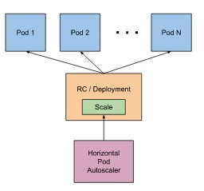
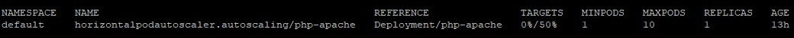

# Autoscalado. HPA Horizontal pod autoscaler

HorizontalPodAutoscaler es un objeto de kubernetes que actualiza automáticamente los recursos de la cargas de trabajo (deployments) para satisfacer la demanda requerida.

Un autoescalado horizontal significa añadir mas pods a nuestro cluster (horizontal autoscaler), hasta llegar a un máximo definido por el usuario; mientras que cuando la carga baja el cluster reduce el número de pods hasta un número mínimo determinado también por el usuario.

## Ejemplo de uso de autoscalado

Para mostrar el funcionamiento de autoscalado vamos a usar un [ejemplo](https://kubernetes.io/docs/tasks/run-application/horizontal-pod-autoscale-walkthrough/) de la documentación propia de kubernetes, siguiendo las siguientes tareas:

1. Validar que la versión de kubernetes este en 1.23. Para versiones anteriores se puede consultar la [documentación oficial de kubernetes](https://kubernetes.io/docs/home/supported-doc-versions/).
2. Instalar en nuestro cluster de kubernetes [Metric Server](https://github.com/kubernetes-sigs/metrics-server#readme). Metric Server es un objeto de kubernetes que colecciona métricas desde los kubelet y los presenta a travéz de kube API. Metric Server no es un objeto que viene nativamente con kubernetes, por lo que se lo puede instalar desde un archivo de manifiesto:

   `kubectl apply -f https://github.com/kubernetes-sigs/metrics-server/releases/latest/download/components.yaml`

Validar la correcta instalación de metric server, identificando en el namespace kube-system el deploy y servicio MetricServer:

`kubectl get all -A`

3. Este ejemplo cuenta con una imagen de php prediseñada para estresarla en nuestro cluster.

4. Crear un servicio que exponga la aplicación de php. Ambas tareas están escritan en un manifiesto público. El cuál lo ejecutamos con:

`kubectl apply -f https://k8s.io/examples/application/php-apache.yaml`

Con este comando creará un deployment/php-apache y un servicio/php-apache. El cual podremos validar con su correcta creación:

`kubectl get all`

5. Crear el objeto autoscaler con el siguiente comando:

   `kubectl autoscale deployment php-apache --cpu-percent=50 --min=1 --max=10`

*kubectl autoscaler* Crea el objeto tipo autoscaler
*deployment php-apache* Es el deploy sobre el cual hara el scalado horizontal.
*--cpu-percentaje=50* indica el porcentaje que ira mmidiendo el metric source antes de empezar a escalar. Debe asegurar que los recursos se mantengan por defacto de este porcentaje.
*--min=1* La cantidad mínima de pods que ejecutará el autoscaler.
*--max=10* La cantidad máxima de pods que ejecutará el autoscaler.
6. Se puede revisar el estado del autoscaler con el comando:
   `kubectl get hpa`
La salida de este comando tiene algunos campos:

NAME: El nombre del autoscaler
REFERENCE: El objeto que se está autoscalando
TARGET: El porcentaje de uso de la CPN vs el límite máximo configurado en el autoscaler.
MINPODS: La cantidad mínima de pods configurados en el autoscaler
MAXPODS. La cantidad máxima de pods configurados en el autoscaler
REPLICAS: La cantidad de réplicas que se encuentra en ejecución.

7. Incrementar la carga del pod, con una imagen prediseñada que añade carga a los pods php-apache
   
   `kubectl run -i --tty load-generator --rm --image=busybox:1.28 --restart=Never -- /bin/sh -c "while sleep 0.01; do wget -q -O- http://php-apache; done"`

8. En una nueva ventana de terminal validar el estado de autoscaler y los deploys

`watch kubectl get hpa php-apache`

`kubectl get deployment php-apache`
