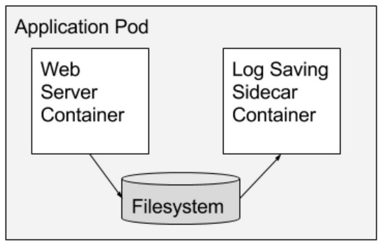
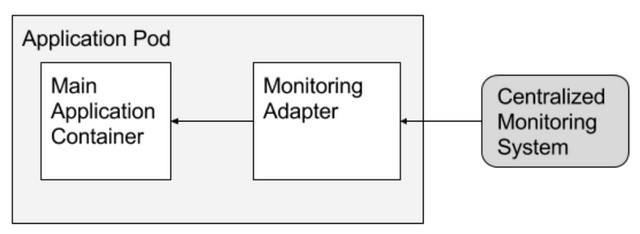
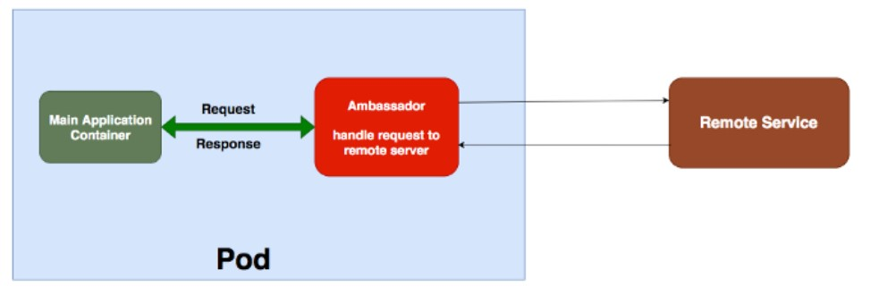

# Multiconteiner

El uso mas frecuente que tienen los pod es que por cada pod exista un solo contenedor. Sin embargo, como se había dicho anteriormente técnicamente en k8s, un pod puede soportar varios contenedores. Ahora veremos en que condiciones sería recomandable esta funcionalidad.

- Cuando los contenedores tienen exactamente el mismo ciclo de vida.
- Cuando los contenedores deben ejecutarse en el mismo nodo.
- El escenario más común es que tiene un proceso auxiliar que debe ubicarse y administrarse en el mismo nodo que el contenedor principal.
- Para una comunicación más simple entre los contenedores en el módulo.

Hay tres patrones de diseño comunes y casos de uso para tener multicontenedores: Sidecar, Adapter y Ambassador

## Sidecar pattern

Consiste en un aplicación principal más un  contenedor auxiliar con una función escencial de la aplicaicón pero que no forma parte en si de aplicación.
Ejemplos de este patr+on sería: 

- Recolector de logs
- Servicios de sincronización
- Agentes de monitoreo.

## Adapter pattern

El patrón tipo **Adapter** se usa para la estandarizar y normalizar las salidas de los datos de la aplicación principal.

Por ejemplo una aplicación requiere que la salida de datos de una segunda aplicación sea en formato [DATE] - [HOST] - [DURATION]  
Pero la salida es [HOST] - [START_DATE] - [END_DATE]. Entonces un contenedor se puede encargar de adaptar a la salida requerida. Con lo tenemos una aplicación mas resiliente.

## Ambassador pattern

El patrón **Ambassador** es una forma útil de conectar contenedores con el mundo exterior. Un contenedor **Ambassador** es esencialmente un proxy que permite que otros contenedores se conecten a un puerto en localhost, mientras que el contenedor Ambassador puede enviar estas conexiones a diferentes entornos según las necesidades del clúster.

El contenedor Ambassador es un tipo especial de contenedor que simplifica el acceso a los servicios fuera del Pod. Cuando ejecuta aplicaciones en kubernetes, es muy probable que deba acceder a los datos de los servicios externos. El contenedor Ambassador oculta la complejidad y proporciona la interfaz uniforme para acceder a estos servicios externos.

Un ejemplo práctico sería tener un pod con un contenedor ejecutándose correctamente pero necesita acceder a servicios externos. Pero estos servicios externos son de naturaleza dinámica o de difícil acceso. A veces hay un formato diferente que devuelve el servicio externo. También hay otras razones y no desea manejar esta complejidad en el contenedor principal. Entonces, usamos los contenedores Ambassador para manejar este tipo de escenarios.

