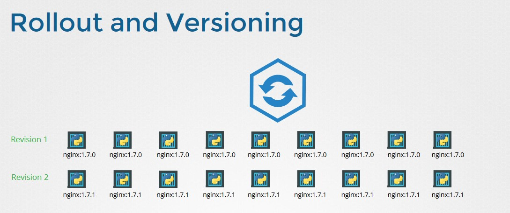

# Rolling Update y Rollbacks (Deployment)

Rolling update en kubernetes es una característica de un deploy que permite actualizar la versión de una imagen con zero tiempo de downtime.

Siempre que es la actualización de un deploy y este se llevará a cabo cuando se modifica los campos de template del pod. Otro cambio como escalado no conlleva una actualización del deploy o roll out.

Por defecto durante una actualización la cantidad mínima de pods no disponibles es 1.

La función de Rolling update nos permite:

- Actualizar la versión de una aplicación monificando la imágen de los contenedores.
- Hacer un rollback de a aplicación si encontra un error en la nueva versión.
- No permite hacer Continuous Integration and Continuous Delivery con cero donwtime.

Para actualizar la imagen de un template de un deploy ejecutamos el comando:

`kubectl set image deployment/nginx-deployment nginx=nginx:1.23.0`

o de manera alternativa podemos editar la configuración del deploy:

`kubectl edit deployment/nginx-deployment`

cambiar la imagen salir y guardar.

Una tercera alternativa es editar el archivo de manifiesto y aplicar los cambios con: `kubectl apply -f <file.yml>`

Una vez aplicado el cambio con cualquiera de las alternativas indicadas podemos ver el proceso del cambio con el comando:

`kubectl rollout status deployment/miapp-deploy`

## Rollback

Cada cambio que hacemos sobre un deploy almacena una número de revisión (versión). Y podemos regresar a una versión anterior.

Ver todas las revisiones disponibles

`kubectl rollout history deployment/myapp-deploy`

Ver el detalle de una revisión específica

 `kubectl rollout history deployment/myapp-deploy --revision=5`

Hacer un rollback a la revisión necesaria

`kubectl rollout undo deployment/myapp-deploy --to-revision=3`

Hacer un rollback a revisión anterior
`kubectl rollout undo deployment/myapp-deploy`

Se puede cambiar la cantidad de revisiones que guarda el deployment.
Dentro de spec usamos el campo: `revisionHistoryLimit (integer)`

## Escalado de un deploy

Al igual que un replicatioset se puede escalar en la cantidad de réplcias que ejecuta un deploy. El comando es parecido a rs pero difiere en el nombre del objeto que vamos a escalar:

`kubectl scale deployment myapp-deploy --replicas=10`

Se puede editar el manifiesto y cambiar el número de réplicas y aplicar los cambios con `kubectl apply -f <archivo.yaml>`