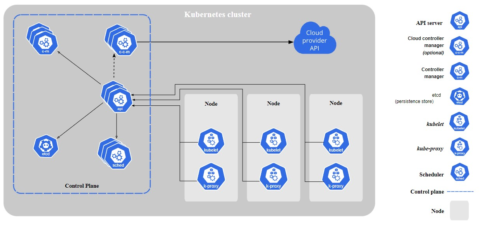

# Arquitectura y componentes de kubernetes

Cuando desplegamos kubernetes tenemos un cluster. que son un conjunto de máquinas que ejecutan las cargas de trabajo (pods), estas máquinas son llamados **nodos (worker nodes)**. Existe el nodo master que es el encargado de administrar el cluster. Este nodo master  se conoce como **control plane** y cuenta con algunos componentes para llevar el control del cluster 

## Componentes del nodo (worker node)
- kubelet Es un agente que se ejecuta en cada nodo y asegura que los pods se ejecuten.  
El kubelet registra  el nodo en el cluster.
Cuando un nodo recinba la instrucción de subir un pod solicita al runtime que suba la imagen requerida.
Monitorea constantemente el estado de salud del nodo para avisar al cluster   

- kube-proxy es un proxy de red que se ejecuta en cada nodo y en cargado de mantener las reglas de networking para la comunicación de los pods con el cluster y los servicios de kuberntes
- Container runtime Este componentede software es el responsable de la ejecución de los contenedores
  

## Componentes del control plane

### kube-apiserver. 
Un servidor API es un componente del control plane que expone la API de Kubernetes. Es el front-end del control plane de Kubernetes.
El apí server expone un http API para que usuarios finales puedan manipular las partes del cluster
sea mediante consultas o moficicaciones del estado del los objetos en kubenetes como (pods, namspaces, configmaps)

### etcd 
Es el almacen de datos clave valor, que guarda información del cluster. Kubernetes almacena todos los objetosusando etcd, podremos obtener información de cluster como: Nodos, pods, configs, secrets, roles haciendo consultas a la base etcd

### Scheduler (kube-scheduler) 
Evalua la capacidad y los recursos de cada nodo para decidir a cual de ellos enviar las cargas de trabajo (pods) 

scheduler es solo responsable de decidir cada pod en que nodo debe ejecutarse, en base a algunas reglas definidaspor el usuario. Por ejemplo ciertos nodos pueden estar dedicados a ciertas aplicaciones, o dependiendo de la capacidad de recursos disponibles en cada nodo.   

Hay varios temas a considerar para decidir la ubicación de un pod, veremos conceptos como:
- resources y limits
- taints y tolerations
- Node Selector/Affinity

Nota. El scheduler decide a donde irá el pod, sin embargo el kubelet de cada nodo es quien lo inicilizará el pod

### Controller-manager (kube-controller-manager) 
Este componente ejecuta proceso de control del cluster como: validar la disponibilidad de los nodos, control de trabajos, control de los accesos por cada namespace.
Así como hacer todo el "esfuerzo" para mantener todo el sistema en funcionamiento

Para hacer todas las tareas tiene dos componentes: Node controler
Replication Controler, job controler, end point controler, router controler, service controller y muchos otros componentes que aseguran el funcionamiento del cluster.