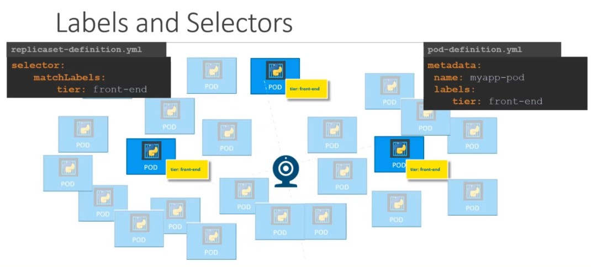

## Replica set

Este es el nuevo objeto de kubernetes que tiene la misma función de replication controler. El objetivo de rs es mantener un conjunto estable de réplicas de Pods ejecutándose en todo momento. Así, se usa en numerosas ocasiones para garantizar la disponibilidad de un número específico de Pods idénticos. Actualmente es la opción recomendada para la gestión de réplicas.

Esta definido en la api version como apps/v1 y habrá que tomar en cuenta este cambio para la construcción del manifiesto.

~~~yaml
apiVersion: apps/v1 #Cambio de la version respecto a replication controller
kind: ReplicaSet #El tipo es Replica Set
metadata:
  name: myapp-rs
  labels:
     app: movil-app
     tipo: front-end
spec:
  template: # Al igual que rc tiene la definición de los pods que se crearán con la réplicas

  replicas: # Al igual que rc es el número de réplicas del pod a ejecutarse

  selector: # <- a diferencia de rc este es un campo requerido en rs

~~~

La especificación técnica para **replicaset** va a ser similar para replication controller. Con la diferencia que el campo *selector* es requerido.

## selector

El campo \"selector\" sirve para identificar a los Pods que pueden formar parte del replicaset, es una manera de filtrar a los pods que usaremos como elementos del rs

En el campo selector vamos a identificar los labels definidos en los pods, busca todas los pods que cumplan esta coicidencia y los hace parte del rs.

Este campo hace posible que pods en ejecución forme parte del rs. Cuando no hay suficientes pods creado el replicaset los crea hasta llegar al número de réplicas deseado.

## template

Una plantilla pod especificando los datos de los nuevos Pods que debería crear para conseguir el número de réplicas esperado. Un ReplicaSet alcanza entonces su propósito mediante la creación y eliminación de los Pods que sea necesario para alcanzar el número esperado (**replicas**). Cuando un ReplicaSet necesita crear nuevos Pods, utiliza su plantilla Pod.

## Scale en replicaset

Modificar el manifiesto del rs y poner la cantidad de réplicas requeridas, despues ejecutar el comando:

`kubectl replace -f rs-definition.yaml`

Otra forma de hacerlo es mediante linea de comando con kubectl con los siguientes argumentos:

`kubectl scale --replicas=6 -f rs.defenition.yaml`

tambien se puede ejecutar el mismo comando pero en lugar del nombre del archivo de manifiesto poner el nombre del rs especificado en los metadatos:

`kubectl scale --replicas=6 replicaset myapp-rs`

## eliminar un replicaset

Para elimminar un rs junto con todos los pods usamos el comando:

`kubectl delete replicaset myapp-rs`

