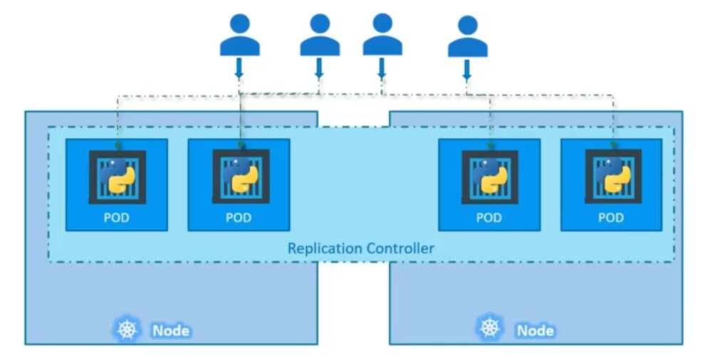
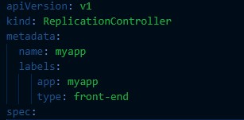
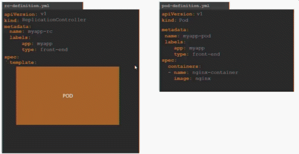

# Controlers

Los controler son el cerebro detras de kubernetes. Pues ayudan a tomar desición cuando un componente falla y buscará los medios para asegura su funcionamiento.

## Replication controler

**Los replication controlers** ayudan a tener multiples instancias de pods ejecuntadose y no perder el acceso a la aplicación. esto provee alta disponibilidad.
Incluso si quieramos tener un solo pod ejecutandose necesitamos un replication controler por que es este quien asegurará que si falla el pod, otro ocupe su lugar. Entonces usaremos replication controler para tener 1 o 100 pods en ejecución.

Los replication controlers también nos ayudarán a ir creando varias instancias de un pod cuando se incremente la carga a la aplicación es decir son necesarios para hacer un balanceo de carga y escalado de cargas de trabajo. Si importar con cuentos nodos trabaje mi cluster el replication controler irá asignando un pod en algún nod disponible del cluster, como se puede ver en la siguiente figura.

### Creación de replication controler

La creación de un replication controler sigue el mismo patrón del manifest de todo objeto en kubernetes:

La sección de spec tendrá los parámetros necesario para este tipo de objetos:

## Replica set

Este es el nuevo objeto de kubernetes que tiene la misma función de replication controler, actualmente es la opción recomendada para la gestión de réplicas.