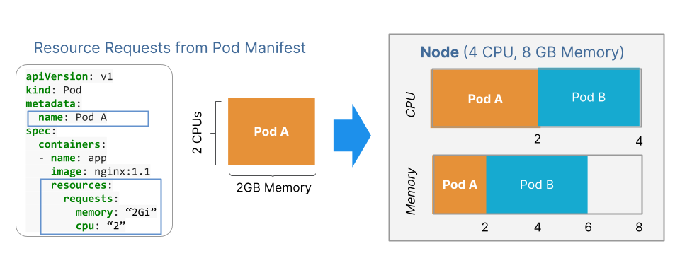

# Resources

El proceso de scheduler valida la cantidad de recursos (cpu y memoria) que requiere el pod y los recursos disponibles en cada nodo. Cuando encuentra un nodo que satisface los requerimientos lo ubica. Cuando no encuentra un nodo para para un pod lo dejará en estado pendiente (pending) hasta que se liberen los recursos necesarios.

Se puede configurar la cantidad de memoria ram y procesador que requiere el contenedor demtro del pod y con esta información el scheduler buscará el nodo mas óptimo. Cuando no se especifica esta información los valores por defecto que kubertes toma son: 0.5 CPU y 256 Mb

## CPU Units

La unidad de medida del CPU en kubernetes es CPU Unit y equivale a 1 core físico (para servidores físicos) o 1 virtual core (para un servidor virtual). Con esta unidad de medida se pueden configurar fracciones, por ejemplo 0.5 equivaldrá a la mitad de un core del CPU del nodo en donde este hosteado el pod.

El recurso de CPU siempre se especifica como una cantidad absoluta de recursos, nunca como una cantidad relativa. Por ejemplo, 500 m de CPU representan aproximadamente la misma cantidad de potencia informática, ya sea que ese contenedor se ejecute en una máquina de un solo núcleo, de dos núcleos o de 48 núcleos.

## Memoria Units

La unidad de medida para la memoria son los bytes. Se puede trabajar tambien con los subfijos: T, G, M, k.

## Resource request

