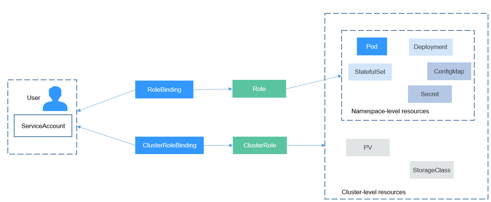
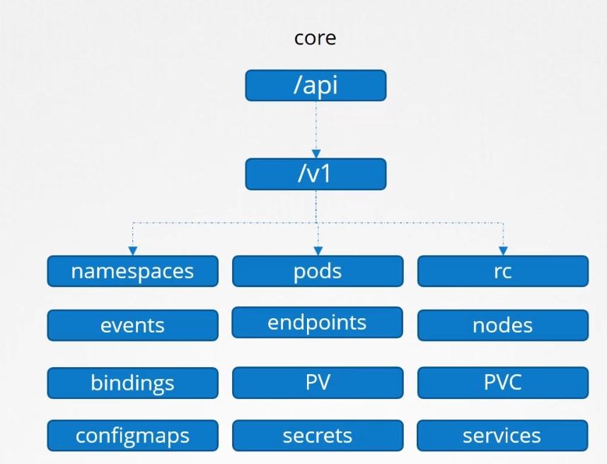
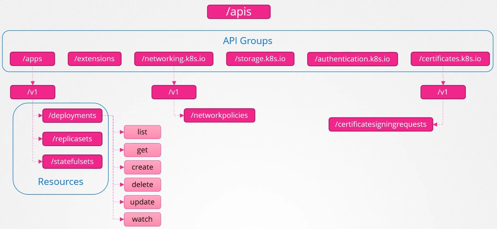

# Role Based Access Control Good Practices RBAC

En kubernetes se usan el concepto de RBAC para controlar el acceso de usuarios y equipos a los objetos y recursos de cluster de kubernetes.

Basado en objetos de tipo **role** (conjunto de namespace, recursos y acciones) y **rolebinding** (donde se especifica los usuarios o las cuentas) se van creando los permisos del cluster.

## Role

Un objeto de tipo role se declara con un manifiesto similar al siguiente.

~~~yaml
apiVersion: rbac.authorization.k8s.io/v1
kind: Role
metadata:
  namespace: espacio1 
  name: admdeploy
rules:
- apiGroups: ["","extensions", "apps"] # "" indicates the core API group
  resources: ["deployments", "replicasets", "pods"]
  verbs: ["get", "list", "create", "update", "patch", "delete"]
~~~

De manifiesto podemos identificar.

*namespace*: El namespace al cual daremos acceso
*apiGroups* El conjunto del API que incluimos en este rol.
*resources* Los resursos de kubernetes
*veerbs* La acciones permitidas dentro de este rol

## Api Group

Kube API server es el componente de la arquitectura de kubernetes que esta presente en cualquier operación que se hace en el cluster. Hacemos una llamada al API de kubernetes mediante el comando kubectl o mediante llamadas o al API REST del servidor master.

API groups facilita el crecimiento del API de kubernetes, porque agrupa varios objetos de la misma clase o mismo propósito por diferentes paths y versiones. Así tenemos /version /api /apis /logs /metrics todo depende dela información que queremos obtener o setear en el cluster.

Los api groups que agrupan los principales objetos de kuberntes son /api y /apis

## RoleBinding

Un objeto RoleBinding otorga los permisos  definidos en un role a un usuario y set de usuarios. En este objeto se declara una lista de sujetos, y una referencia al rol al que se quiere acceder. El rolebinding otorga los permisos dentro de un namespace específico.  

~~~yaml
apiVersion: rbac.authorization.k8s.io/v1
kind: RoleBinding
metadata:
  name: deployment-manager-binding
  namespace: espacio1
subjects:
- kind: User
  name: employee
  apiGroup: ""
roleRef:
  kind: Role
  name: admdeploy
  apiGroup: ""
~~~

En el manifiesto de un RoleBinding podemos destacar los siguientes campos:

- namespace. Indica el campo sobre el cual se otorgará los permisos.
- Subjects. En esta sección del manifiesto se ubica los sujetos a los cuales se otorgará el permiso.
  - subject/kind El tipo de sujeto al cual se otorgará permiso
  - subject/name: Nombre de usuario.
- roleRef: En esta sección del manifiesto se indica la referencia del rol del cual queremos los permisos.
  - roleRef/name El nombre del Role al cual queremos asignar.

## Probar los controles

Una vez creado los objetos Role y RoleBinding, vamos a probar el acceso al namespace Espacio2 con los objetos tipo pod.

`kubectl get pods`

Podríamos crear roles con permisos especificos para desarrolladores, operadores y tester.

