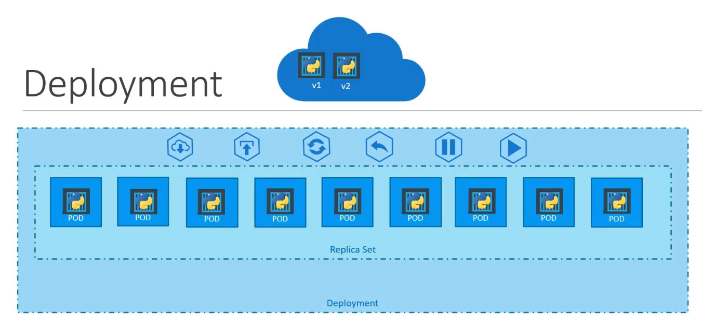
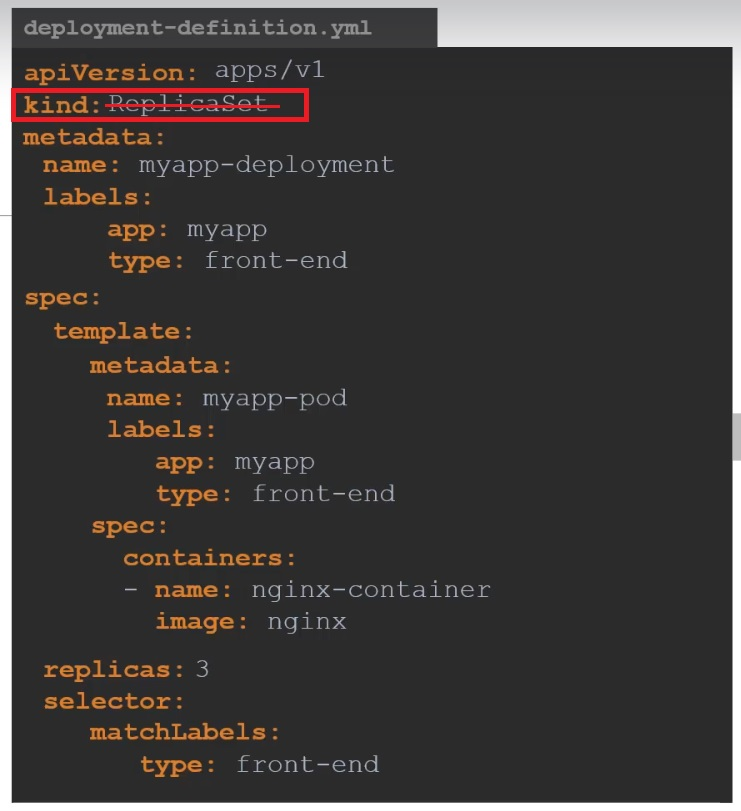

# Deployment

En un objeto de tipo deployment es una descripción declarativa de un estado deseado para pods y replicaset.

Un deployment es un objeto que administra pods y replicaset, y añade ciertas funcionalidades necesarias para despliegue de aplicaciones como;

- Despliegue automático de contenedores en la cantidad deseada. (Réplicas de pods)
- Facilita el despligue de nuevas versiones de la aplicación a través de nuevas versiones de imágenes
- Despliegue controlado de las nuevas versiones de la aplicación. Rolling update
- Permite hacer un rollback de un despliegue si la aplicación tuviera un error no esperado (rolling back). Deshace el cambio reciente.  
- Permite pausar y reacer los cambios en el cluster según sea necesario

De la figura se puede observar como los contenedores están encapsulados en los pods, los replicaset contienen réplicas de multiples pods, mientras que en los mas alto de esta jerarquía está los deployment que son los objetos que permiten administrar lo replicaset agregando mas funcionalidades.

## Manifiesto del delployment

El archivo de manifiesto o de definición de deployment es similar al de replicaset, con solo un cambio: el campo kind se especifica por **Deployment**

~~~yaml
apiVersion: apps/v1
kind: Deployment
metadata:
  name: myapp-deploy
  labels:
     app: movilapp
     tipo: front-end
spec:
  replicas: 3
  template:
    metadata:
      name: myapp-pod
      labels:
        app: movilapp
    spec:
      containers:
        - name: myapp-container
          image: nginx:1.22.0
          ports:
            - containerPort: 80
  selector:
    matchLabels:
      app: movilapp
~~~

## Revisando los deployment's creados

Al igual que todos los objetos en k8s, podemos consultar con el siguiente comando:

`kubectl get deployment`

Cuando inspeccionas los Deployments del clúster, se podrán ver los siguientes campos:

- NAME muestra los nombre de los Deployments del clúster.
- READY muestra cuántas réplicas de la aplicación están disponibles.
- UP-TO-DATE muestra el número de réplicas que se ha actualizado para alcanzar el estado deseado
- AVAILABLE muestra cuántas réplicas de la aplicación están disponibles para los usuarios
- AGE muestra la cantidad de tiempo que la aplicación lleva ejecutándose.

En el mismo comando si agregamos la bandera `-o wife` podremos visualizar mas campos del deploy

## Actualizar un deployment (roll out)

Un rollout es la actualización de un deploy y este se llevará a cabo cuando se modifica los campos de template del pod.
Otro cambio como escalado no conlleva una actualización del deploy o roll out.

Para actualizar la imagen de un template de un deploy ejecutamos el comando:

`kubectl set image deployment/nginx-deployment nginx=nginx:1.23.0`

o de manera alternativa podemos editar la configuración del deploy:

`kubectl edit deployment/nginx-deployment`

cambiar la imagen salir y guardar.

Una tercera alternativa es editar el archivo de manifiesto y aplicar los cambios con: `kubectl apply -f <file.yml>`

Una vez aplicado el cambio con cualquiera de las alternativas indicadas podemos ver el proceso del cambio con el comando:

`kubectl rollout status deployment/miapp-deploy`

## Rollback

Cada cambio que hacemos sobre un deploy almacena una número de revisión (versión). Y podemos regresar a una versión anterior.

Ver todas las revisiones disponibles

`kubectl rollout history deployment/myapp-deploy`

Ver el detalle de una revisión específica

 `kubectl rollout history deployment/myapp-deploy --revision=5`

Hacer un rollback a la revisión necesaria

`kubectl rollout undo deployment/myapp-deploy --to-revision=3`

Hacer un rollback a revisión anterior
`kubectl rollout undo deployment/myapp-deploy`

## Escalado de un deploy

Al igual que un replicatioset se puede escalar en la cantidad de réplcias que ejecuta un deploy. El comando es parecido a rs pero difiere en el nombre del objeto que vamos a escalar:

`kubectl scale deployment myapp-deploy --replicas=10`

Se puede editar el manifiesto y cambiar el número de réplicas y aplicar los cambios con `kubectl apply -f <archivo.yaml>`

