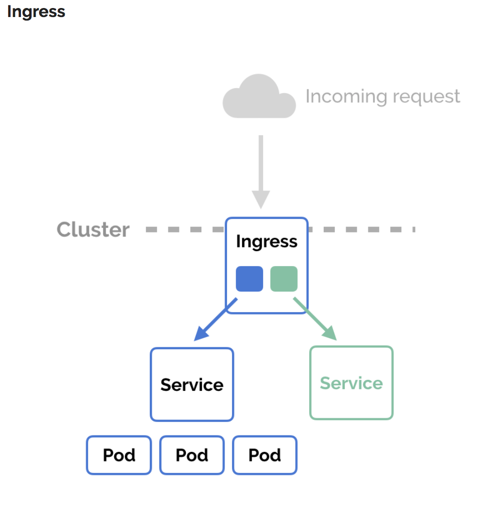
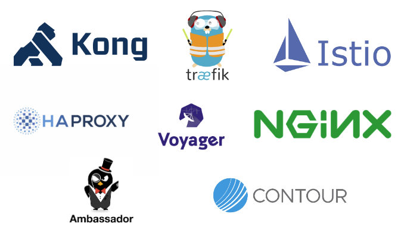

# Ingress

Problemas/retos que se tiene para el acceso de los usuarios a una aplicación hosteada en un cluster de kubernetes son:

- En un cluster on-premise no tengo un servicio de tipo loadbalancer
- En un hosting de nube necesito tantos loadbalancer como aplicaciones quiere desplegra
- Por cada loadbalancer es una nueva ip pública, lo que incrementa los costos.
- La gestión de certificados SSL para la https
  
**Ingress** es un objeto del API de kubernetes que gestiona las rutas de accesos a los servicios del cluster, generalmente acceso de tipo http y https. En resumen es un objeto que ayuda a que los usuarios finales accedan a las aplicaciones a través de un conjunto de reglas.

Las funcionalidades que podemos obtener con Ingress son load balancer, SSL y virtual hosting.

Ingress expone HTTP y HTTPS para usuarios finales, mientras se comunica internamente con los servicios del cluster kubernetes.

**Ingress resources** son configuraciones y las reglas de routing requeridas para exponer y administrar el ingreso de las solicitudes de usuario.

Un **Ingress controller** son las herramientas responsables del funcionamiento del Ingress, generalmente con load balancer, a través de la configuración de edge router o frontends adicionales para ayudar a manejar el tráfico.

Un ejemplo de configuración de Ingress sería:

~~~yaml
apiVersion: networking.k8s.io/v1
kind: Ingress
metadata:
  name: minimal.ingress
  annotations:
    ingress.kubernetes.io/ssl-redirect: "false"
spec:
  rules:
  - http:
      paths:
      - path: /
        pathType: Prefix
        backend:
           service:
             name: servicio-clusterip
             port:
               number: 8080
      - path: /web
        pathType: Prefix
        backend:
           service:
             name: servicio-clusterip2
             port:
               number: 8090

~~~

Se identifica los campos apiVersion, kind, metadata y spec al igual que la mayoría de objetos en kubernetes

El nombre de Ingress debe ser valido para subdominio DNS.

Ingress usan de manera frecuente **annotations** para configurar algunas opciones dependiendo del Ingress controller. Diferentes Ingress contollers soportan diferentes annotatioms, habrá que revisar la documentación dependiendo del Controler que se va a utilizar.

Spec es la sección de la configuración en donde se establecen las características del objeto, y si funcionará como balanceo de carga o reverse proxy.

Mas importante spec, contiene la reglas de incoming request. Ingress solo soporta reglas de redirección HTTP(s)

Este ingress requiere que se este ejecutando dos servicios:

- servicio-clusterip en el puerto 8080
- servicio-clusterip2 y e el puerto 8090

Entonces lo que hará el ingres es redigir todo las solicitude / al servicio 1 mientras que las solicitudes a /web redirigirá al segundo servicio.

Con esto tenemos publicado una sola IP pero atendiendo con dos serbicios diferentes.

