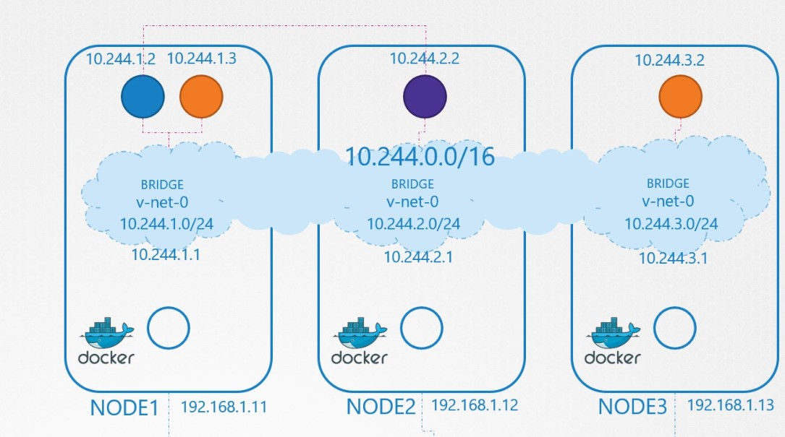
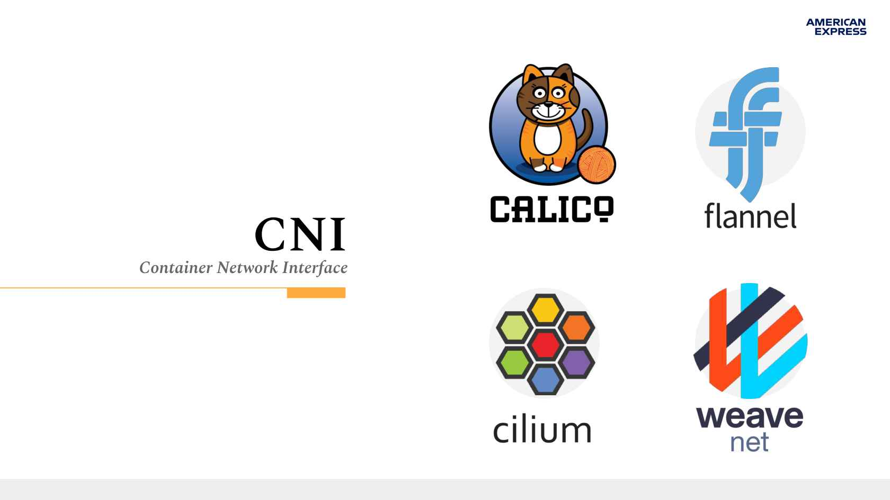

# Modelo de red en kubernetes

Los componentes de Kubernetes no incluye la solución de networking para la comunicación de los elementos del cluster. Por lo que es un proveedor de networking que hará el trabajo a través del cumplimiento de ciertos requerimientos:

- Cada Pod obtiene su propia IP.
Por esto no es una preocupación la configuración manual o la interconexión entre pods. Tampoco será necesita mapear los puertos entre el nodo y los pods.

- Los pods pueden comunicarse con otros pods dentro del mismo nodo si están en la mism red de clase C (máscara 24)
  
- Los pods pueden comunicarse con otros pods en otros nodos sin necesidad de NAT. Para lo cual deben tener un mismo gateway dentro de una red con mascara 16
  
- Agentes en un nodo (como daemonset o kubelet) pueden comunicarse con los pods en el nodo.

 

La ip en kubernetes se configura en el pod, por lo que los contenedores del mismo pod compartiran comparten el namespace, la dirección IP y mac address. Por lo que cada contenedor de un mismo pod, debería escuchar en puertos diferentes.

El direccionamiento de red en kubernetes:

- Contenedores dentro de un mismo pod se comunican via loopback.
- Un cluster de networking provee la comunicación entre pods.
- Los objetos de tipo services que permiten exponer una aplicación que se ejecuta en un pod no estarán disponibles fuera del cluster.
- Se puede usar servicios para publicar servicios solo de consumo dentro del cluster.

## Container Network Interface (CNI) en kubernetes

CNI es un estándar diseñado para facilitar la configuración de redes de contenedores cuando se crean o destruyen contenedores. Estos complementos hacen el trabajo de asegurarse de que se cumplan los requisitos de red de Kubernetes y de proporcionar las funciones de red que requieren los administradores de clústeres.

## Validar direccionamiento 

Los pods ejecutadonse en este nodo obtendrán el direccionaiento IP dentro de esta red

`kubectl describe nodes worker1 | grep podCIDR `

verificar la ip del pod dentro del nodo

`kubectl describe pod mynginx | grep IP`

## Terminología

Algunos términos que se usarán en este capítulo:

*Nodo* Es un servidor que forma parte de un cluster kubernetes

*Cluster* Multiples nodos que ejecutan aplicaciones contenerizadas y administradas por kubernetes.

*Edge router* Una ruta que asegura las politicas de firewall para el cluster. Esto podría lo podría hacer un gateway administrado por un proveedor de nube o una appliance de hardware especializado.

*Cluster network* un conjunto de enlaces, lógicos o físicos, que facilitan la comunicación dentro del cluster de acuerdo a l modelo de red de kubernetes.
