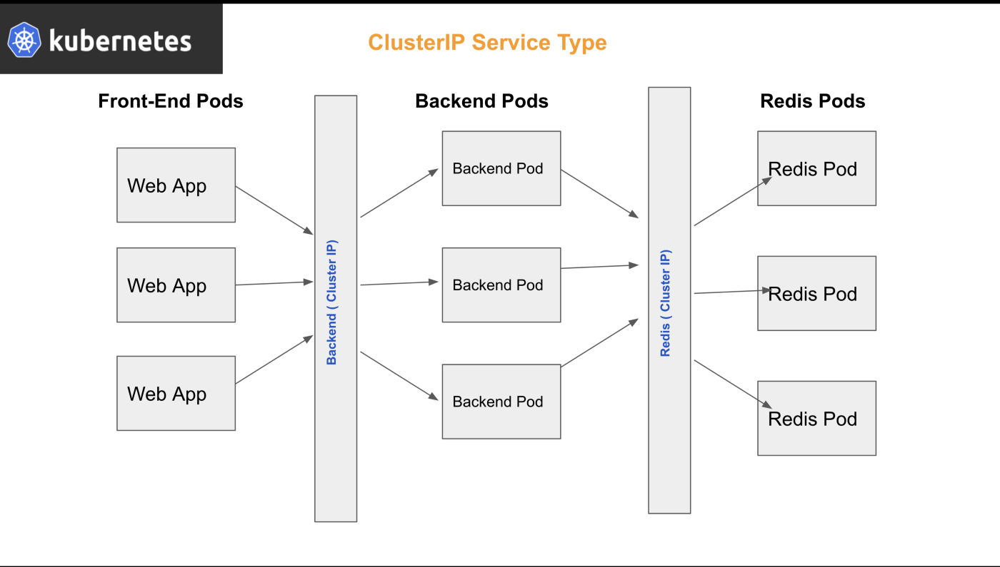

# Cluster Ip

Tipos. Cluster IP (default service)
Acceso al servicio solo desde dentro del cluster a traves de una ip

Exponer un conjunto de pods expuesto para llegar a ellos desde dentro del cluster.

Es la solución ideal para llegar a un conjunto de pods administrados por un replica set o replication controller, el servicio va balancear las peticiones distribuyendo a cada pod del cluster. Con esto no envio las peticiones a cada pod sino al servicio de tipo clusterip.

~~~yaml
apiVersion: v1
kind: Service
metadata:
  name: Backend
spec:
  selector: 
    app: movilapp
  type: ClusterIP
  ports:
    - targetPort: 80 #Puerto al que el servicio envia el trafico (puerto de escucha del pod)
      port: 80
~~~

Creamos el servicio ejecutando el comando que aplica el manifiesto:

`kubectl apply -f servicecluster.yaml`

Podemos ver el servicio creado con:

`kubectl get all`

o

`kubectl get service`

La salida de este comando son los campos

NAME: Nombre del cluster, que sale del metadatos del archivo de manifiesto
TYPE: El tipo de servicio, em este ejemplo cluster ip

CLUSTER-IP. La ip que le asigna el cluster a este servicio. Siempre será una dirección privada

EXTERNAL-IP. Es la ip externa como se puede llegar al cluster pero en nuestro caso al ser un cluster ip este solo se accede desde dentro del cluster

PORT: Puerto de escucha del servicio

AGE. El tiempo que esta vivo el servicio

Para probar la correcta funcionalidad del servicio podemos, desde un nodo del cluster hacer un telnet al puerto 8080 o la instrucción:

`curl <cluster-ip:8080>`

Deberíamos ver por terminal el html del index de nginx.

## Asignar una ip al clusterip

Si no se especifica ningún parámetro en la creación de servicio ClusterIp el sistema asignará uno de manera automática.

Si se desea asignar un ip se debe usar el campo `ClusterIP: <ip_asignada>`
