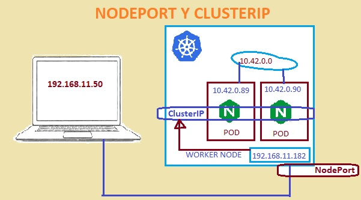
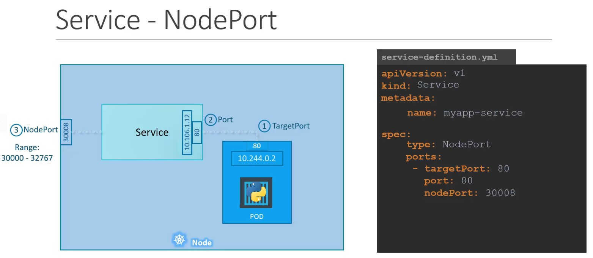
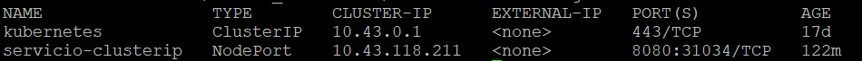
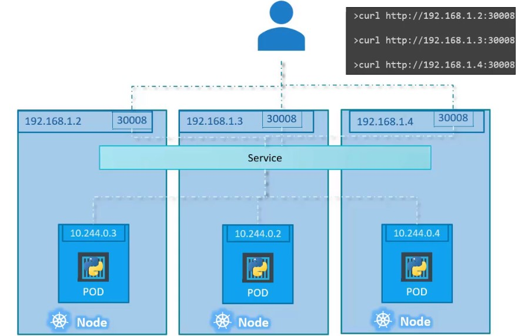

# NodePort

Un servicio de tipo NodePort publica un puerto del nodo por el cual podremos acceder a los pods en los puertos internos de los contenedores.

Se crea una esquema de red similar al que se muestra a continuación:

Con un servicio de tipo nodeport se debe declarar 3 puertos:

- targetport: El puerto de escucha del pod, este campo es opcional y si no se especifica el puerto asume que es el mismo puerto del campo port. 
- port: Es único puerto obligatorio que se debe llenar en el manifiesto y especifica el puerto sbre el cual escuchará el servicio.
- nodeport: El puerto que abriremos en el nodo, debe ser un número entre 30000 y 32700. Si no se espcifica este canpo k8s asigna randómicamente el puerto en el rago indicado.

## Archivo manifest

~~~yaml
apiVersion: v1
kind: Service
metadata: 
   name: myapp-service

spec:
   type: NodePort
   ports:
     - targetPort: 80
     - port: 80
     - nodePort: 30050
   selector:
      app: movilapp
~~~

El servicio NodePort crea un clusterip service y añade el puerto de escucha en cada nodo (nodePort).
`kubectl apply -f nodeport.yaml`

`kubectl get services`

La salida del comando `kubectl get services`

Si un pod que cumple con los filtros de selector se está ejecutado en un segundo o tercer nodo, automáticamente el servicio reenviará el tráfico al pod que esta en estos nuevos nodos (al puerto nodeport), sin otra configuración adicional que tengamos que realizar.

