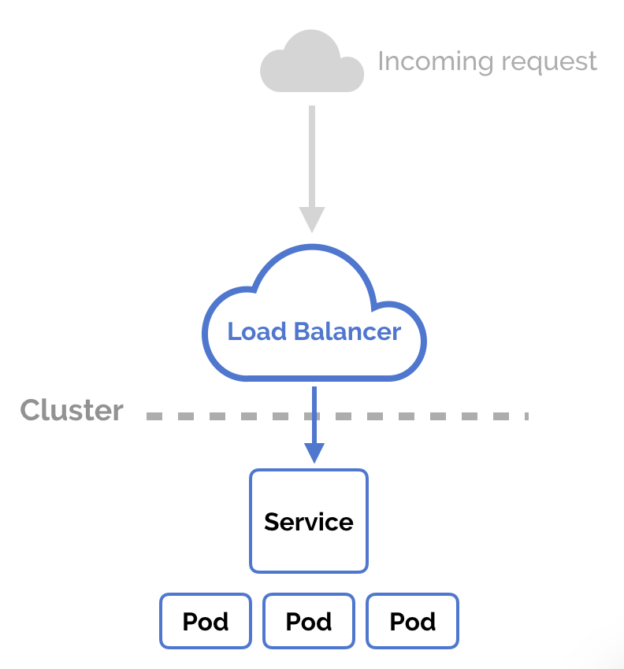
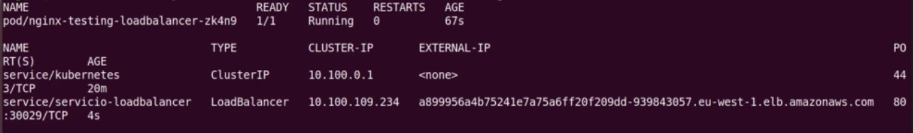

# LoadBalancer service

El service de tipo nodeport nos ayudan a publicar y poner disponible nuestro servicio a través de la ip y el puerto de nodo. Sin embargo el acceso para un usuario final va a ser complicado porque debería conocer todas las ips de los nodos que fotrman parte del cluster.

Entonces un servicio de tipo loadbalancer provee una entrada única al cluster a través de una ip pública y un dns. Este tipo de servicio estará disponible ÚNICAMENTE desde los proveedores de nube como AWS, AZURE, GCE. La integración nativa entre los servicios de nube y kubernetes hará posible la configuración de este objeto en kubernetes.

Sin embargo para propósitos de prueba del funcionamiento se creará un servicio con el tipo loadbalancer.

~~~yaml
apiVersion: v1
kind: Service
metadata: 
   name: myapp-service

spec:
   type: LoadBalancer #Este es el único parámetro que debemos cambiar
   ports:
     - targetPort: 80
     - port: 80
     - nodePort: 30050
   selector:
      app: movilapp
~~~

Veamos un ejemplo de una salida del comando `kubectl get services` en un entorno con loadbalancer en AWS

Se puede visualizar una dirección url de AWS con la cual a través del puerto 80 tendremos acceso al sitio web.