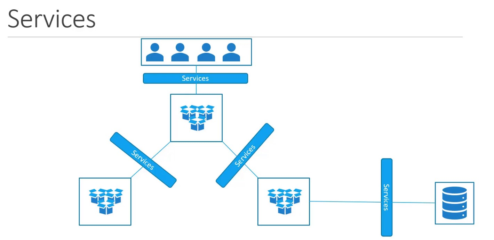
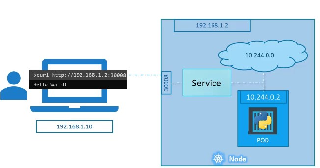

# Services

El objeto ***service*** de kubernetes permitirá la comunicación entre varios componente dentro y fuera de la aplicación.

El objeto Service ayuda a mantener conectadas las aplicaciones entre si y el acceso para los usuarios. 

Mediante un servicio será la manera de exponer  un pod sin hacer cambios en la configuración de la aplicación.

Un servicio (service) va a constar de una nombre dns y una ip. 

autodescubrimiento. 
los servicios seran encontrados por su nombre si esta dentro del cluster

~~~yaml
piVersion: v1
kind: Service
metadata:
  name: servicio
spec:
  type: ClusterIp|NodePort|LoadBalancer
  selector:
    app: MyApp
  ports:
    - protocol: TCP
      port: 80
      targetPort: 9376

~~~

Tipos. Cluster IP (default service)
Acceso al servicio **\"solo desde dentro del cluster\"** a traves de una ip que es la que representa a un conjuto de pods.

Node Port
Este tipo de servicio se usa cuando queremos exponer un servicio en la ip principal en cada uno de los nodos del cluster.

Crea un cluster ip y crea un puerto en cada nodo 

Load Balancer exponer un servicio externamente para balancer la carga. Crea un nodeport y cluster ip mas el balanceador de carga

ExternalName. Cuando reciba una petición regresa el valor de un registro dns tipo cname. Es como  dns interno del cluster.

