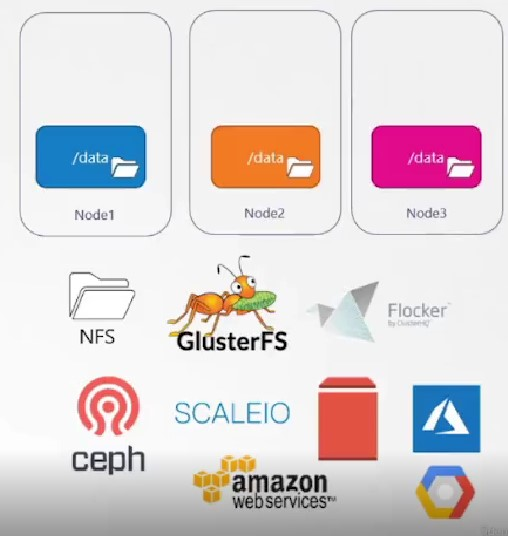

# Persistent volume

Los persistent volumen es un objeto tipo  cluster de recursos de storage que es configurado por un administrador de kubernetes.

En la definición de la especificación del objeto PersistentVolume se debe especificar el lugar en donde se almacenará los datos de manera persistente. Pudiendo ser estos en el cluster local (Sistema de archivos de un nodo), en un servidor NFS o en algún proveedor de nube.

Para el cluster de kubernetes el storage (lugar de almacenamiento) es una llamada a un plugin desarrollado por algún proveedor quién han echo uso del api para desarrollar sus propias soluciones (container storage interface).

En la documentación de kubernetes se puede encontrar los diferentes [tipos de volumenes](https://kubernetes.io/es/docs/concepts/storage/volumes/#volume-types) (storage backeds) que se puede utilizar.

## Definición de persistent volume

Al igual que otros objetos de kubernetes, persistent volume se crea desde un archivo de manifiesto tipo yaml

~~~yaml
apiVersion: v1
kind: PersistentVolume
metadata:
   name: pv01
spec:
  storageClassName: manual
  accessModes:
    - ReadWriteOnce
  capacity:
    storage: 100M
  hostPath: #Aca se especifíca el tipo de volumen a utilizar
    path: /root/pvdata
~~~

Su definición es similar a cualquier objeto de k8s. La sección de spec es donde se definirán los parámetros como: 

- accessModes: Es el modo de acceso que se tendrá a los volumenes. Este mode de acceso es de acuerdo a las características que el   proveedor disponga. Los valores posibles son:
  - ReadWriteOnce, El volumen se puede montar como leer y escribir por UN SOLO NODO. Varios pods podrían leer y escribir si todos están en el mismo noso
  - ReadOnlyMany, el volumen puede ser montado como solo lectura por varios nodos.
  - ReadWriteMany el volumen puede ser montado como lectura escritura por varios nodos
  - ReadWriteOncePod.
  
  En la documentación de kubernetes se puede ver el accessMode soportado por cada tipo de volumen. [Link](https://kubernetes.io/docs/concepts/storage/persistent-volumes/#access-modes)
- capacity: indica cuanta capacidad tiene el volumen puede ser en Megas, Giga o Teras
- hostPath: indica el tipo de volumen. 

## Uso de los persistent volume

En un entorno de operaciones del cluster, se pueden identificar dos roles:

- Un usuario administrador del cluster, quién tiene que ser conciente de la infraestructura del almacenamiento, su orginen y naturaleza; de ahí su responsabilidad de la configuración de los persistent volume.
- El otro rol es un usuario del cluster, quién solo quiere desplegar sus apliciones, y pedir un volumen para almacenar los datos, es decir hacer una solicitud o reclama un volumen (**Persistent Volume Claim PVC**).
  

## Persitent Volume Claim

Un pvc es un solicitud que hace un usuario del cluster para que se le entrege un persistent volume existente.

Cuando se hace esta solicitud el cluster busca de todos los persistent volumes disponibles y le asigna aquel que cumple las condiciones requeridas.

la configuración de un pvc se lo hace mediante un manifiesto yaml, en el cual se especificará los parámetros que se busca.

~~~yaml
apiVersion: v1
kind: PersistentVolumeClaim
metadata:
  name: miclaim
spec:
  storageClassName: manual
  accessModes:
    - ReadWriteOnce
  resources:
     requests:
       storage: 100M
~~~

Este tipo de objeto pvc, detalla las características del persitent volume que se busca.

*accessModes:* El modo de acceso que se quiere en el persisten volume

*resorces* la lista recursos
*request* los requerimientos
*storage* el tamaño del volume que buscamos

## Usar pvc en un pod

~~~yaml
    apiVersion: v1
    kind: Pod
    metadata:
      name: mypod
    spec:
      containers:
        - name: myfrontend
          image: nginx
          volumeMounts:
          - mountPath: "/var/www/html"
            name: mypd
      volumes:
        - name: mypd
          persistentVolumeClaim:
            claimName: miclaim
~~~