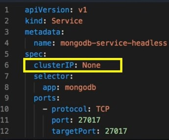

# StatefulSet

Un objeto de kubernetes usado para gestionar aplicaciones que necesitan guardar su estado. Al igual que un deploy crea réplicas de pod pero garantiza el orden y la identidad única del pod.

Ejemplo de este tipo de aplicaciones son las base de datos. Dado que aunque pueden tener la misma imagen del contenedor cada uno tiene una identidad y función propia. Para este tipo de aplicaciones se necesita que kubernetes cumpla estas funciones:

- Mantener una identidad asociada a cada pod
- Dar un orden en el despliegue de los pods
- No se puede iniciar un pod si un pod previo no se ha iniciado.
- Asegurarse de crear con el mismo nombre si pod debe ser recreado
- La elimiacion de los pods es en orden reverso, es decir empieza desde el último.
- Despues de un reinicio de pods sus ips cambian pero el nombre dns se mantiene

## Componentes

Los componentes requeridos para crear un StatefulSet:

    - Servicio Headless, se usa para que la comunicación sea directa y de manera individual a cada pod. Un cliente de un aplicación statefull debe "conocer" la IP de los pods para saber a que pod hacer un requerimiento.
    

    - Un Objeto StatefulSet, Un objeto del API de kubernetes que llevará el control de las funciones de statefull 
    - Un volumeClaimTemplate que proporciona almacenamiento estable por medio de PersistentVolumes provisionados por un provisionador de tipo PersistentVolume.

~~~yaml
apiVersion: v1
kind: Service
metadata:
  name: nginx
  labels:
    app: nginx
spec:
  ports:
  - port: 80
    name: web
  clusterIP: None
  selector:
    app: nginx
---
apiVersion: apps/v1
kind: StatefulSet
metadata:
  name: web
spec:
  serviceName: "nginx"
  replicas: 2
  selector:
    matchLabels:
      app: nginx
  template:
    metadata:
      labels:
        app: nginx
    spec:
      containers:
      - name: nginx
        image: k8s.gcr.io/nginx-slim:0.8
        ports:
        - containerPort: 80
          name: web
        volumeMounts:
        - name: www
          mountPath: /usr/share/nginx/html
  volumeClaimTemplates:
  - metadata:
      name: www
    spec:
      storageClassName: storage-local
      accessModes:
        - ReadWriteOnce
      resources:
        requests:
          storage: 200Mi  
~~~